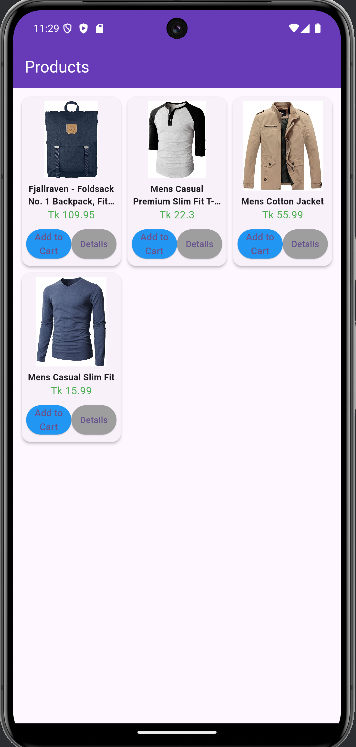
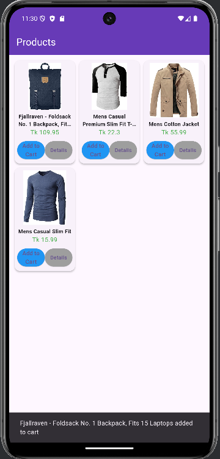
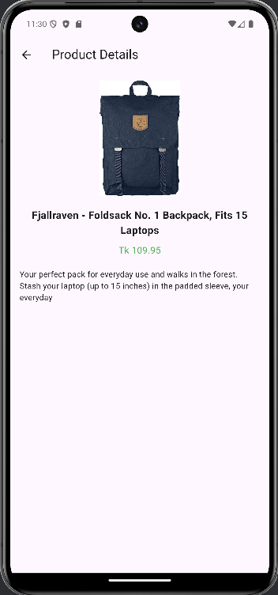

# final_exam_api

Fake store E-commerce app

## Getting Started


ShopSpot is a stylish and simple Flutter app that displays a product list from a local JSON file. Users can:

- ✅ View all products
- ✅ See product details
- ✅ Add products to cart (with a success popup)
- ✅ Navigate smoothly between Home, Products

---

## 📱 Screenshots

| Home Page                | Add to Cart                    | Product Details                |
|--------------------------|----------------------------------|--------------------------------|
|  |  |  |

> 📁 Place all 4 screenshots in a folder named screenshots inside your project root.

---

## 🚀 Features

- Hero animation for logo transition
- Gradient background on home
- Local JSON data parsing
- Product details page with info
- Toast message on Add to Cart
- Clean and responsive UI

---

## 🛠 How to Run

1. Clone this repository:
   ```bash
   git clone https://github.com/rakib-7/final_exam_api
  


👨‍💻 Developed by
Mohammad Rakib

With Flutter 🚀
